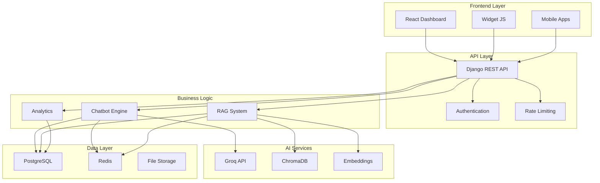
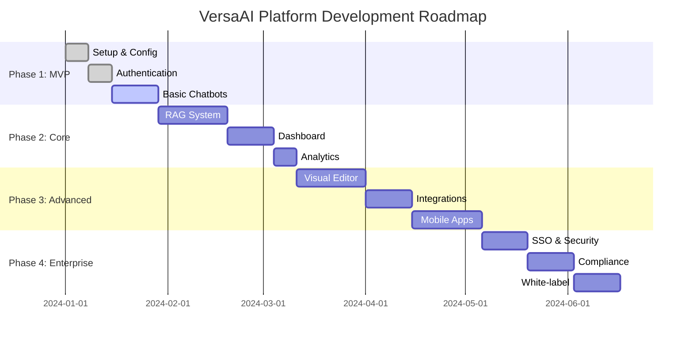

# 🌟 **Portal VersaAI Platform - Documentación Completa**

<div align="center">


**🚀 Plataforma de Chatbots con IA de Nueva Generación**

*React + TypeScript + Django + PostgreSQL + Redis + ChromaDB + Groq API*

</div>

---

## 🎯 **Navegación Rápida**

<table>
<tr>
<td width="50%">

### 📋 **Documentación Técnica**
- 📖 [**Resumen Ejecutivo**](./VersaAI-Resumen-Ejecutivo-Inicio-Rapido.md)
- 🔧 [**Configuración Completa**](./VersaAI-Configuracion-Completa.md)
- 📚 [**Documentación Técnica Detallada**](./VersaAI-Documentacion-Tecnica-Completa.md)
- 🏗️ [**Flujo de Trabajo**](./VersaAI-Flujo-Trabajo-Completo.md)

</td>
<td width="50%">

### 🎨 **Experiencias Interactivas**
- 🌐 [**Visión Interactiva 3D**](./VersaAI-Vision-Interactiva-3D.html)
- 💻 [**Simulador de Desarrollo**](./VersaAI-Entorno-Desarrollo-Simulado.html)
- 🎮 [**Flujo de Desarrollo Interactivo**](./VersaAI-Flujo-Desarrollo-Interactivo.html)
- 🏠 [**Índice Interactivo Completo**](./VersaAI-Indice-Interactivo-Completo.html)

</td>
</tr>
</table>

---

## 🚀 **Inicio Rápido (2 minutos)**

### **1. Prerrequisitos**
```bash
✅ Docker 20.10+
✅ Node.js 18+
✅ Python 3.11+
✅ Git 2.30+
```

### **2. Configuración Express**
```bash
# Clonar y configurar
git clone [repository-url]
cd versaai-platform
cp .env.example .env

# Ejecutar setup automático
./scripts/setup.sh    # Linux/Mac
.\scripts\setup.ps1   # Windows

# Iniciar desarrollo
./scripts/dev.sh      # Linux/Mac
.\scripts\dev.ps1     # Windows
```

### **3. Acceder**
- 🌐 **Frontend**: http://localhost:3000
- 🔧 **Backend**: http://localhost:8001
- 👨‍💼 **Admin**: http://localhost:8001/admin

---

## 🏗️ **Arquitectura del Sistema**



---

## 🛠️ **Stack Tecnológico**

<table>
<tr>
<td width="25%" align="center">

### **Frontend**


</td>
<td width="25%" align="center">

### **Backend**


</td>
<td width="25%" align="center">

### **Databases**


</td>
<td width="25%" align="center">

### **AI & Infrastructure**


</td>
</tr>
</table>

---

## 📊 **Características Principales**

<table>
<tr>
<td width="33%">

### 🤖 **Gestión de Chatbots**
- ✅ Editor visual de flujos
- ✅ Múltiples modelos de IA
- ✅ Personalización avanzada
- ✅ A/B testing
- ✅ Análisis de rendimiento

</td>
<td width="33%">

### 🧠 **Sistema RAG Avanzado**
- ✅ Búsqueda semántica
- ✅ Embeddings optimizados
- ✅ Chunking inteligente
- ✅ Múltiples fuentes
- ✅ Actualización en tiempo real

</td>
<td width="33%">

### 🔒 **Seguridad Enterprise**
- ✅ Autenticación JWT
- ✅ 2FA integrado
- ✅ CORS configurado
- ✅ Rate limiting
- ✅ Cifrado de datos

</td>
</tr>
</table>

---

## 🎨 **Experiencias Visuales**

### **🌟 Destacados**

<table>
<tr>
<td width="50%">

#### 🎮 [**Visión Interactiva 3D**](./VersaAI-Vision-Interactiva-3D.html)
*Experiencia inmersiva con animaciones y diagramas interactivos*

**Características:**
- 🎨 Animaciones CSS avanzadas
- 🔄 Diagramas interactivos
- 📱 Responsive design
- 🎯 Demo de widget embebible

</td>
<td width="50%">

#### 💻 [**Simulador de Desarrollo**](./VersaAI-Entorno-Desarrollo-Simulado.html)
*IDE simulado con terminal, editor y vista previa*

**Características:**
- 🖥️ Terminal interactivo
- 📝 Editor de código
- 👁️ Vista previa en tiempo real
- 🔧 Configuraciones reales

</td>
</tr>
</table>

### **📋 Documentación Visual**

<table>
<tr>
<td width="50%">

#### 🏗️ [**Arquitectura Interactiva**](./VersaAI-Arquitectura-Interactiva.svg)
*Diagrama SVG con animaciones y detalles técnicos*

**Incluye:**
- 🔄 Flujo de datos animado
- 📊 Métricas en tiempo real
- 🎯 Puntos de integración
- 🔧 Detalles técnicos

</td>
<td width="50%">

#### 🎮 [**Flujo de Desarrollo**](./VersaAI-Flujo-Desarrollo-Interactivo.html)
*Simulación del proceso de desarrollo completo*

**Fases:**
- ⚙️ Configuración inicial
- 🏗️ Desarrollo backend
- ⚛️ Desarrollo frontend
- 🧠 Sistema RAG
- 🚀 Despliegue

</td>
</tr>
</table>

---

## 📚 **Guías de Referencia**

### **🔧 Configuración y Setup**

| Documento | Descripción | Tiempo |
|-----------|-------------|--------|
| [**Resumen Ejecutivo**](./VersaAI-Resumen-Ejecutivo-Inicio-Rapido.md) | Guía de inicio rápido y overview | 5 min |
| [**Configuración Completa**](./VersaAI-Configuracion-Completa.md) | Setup detallado paso a paso | 15 min |
| [**Flujo de Trabajo**](./VersaAI-Flujo-Trabajo-Completo.md) | Metodología de desarrollo | 10 min |

### **📖 Documentación Técnica**

| Documento | Descripción | Audiencia |
|-----------|-------------|----------|
| [**Documentación Técnica**](./VersaAI-Documentacion-Tecnica-Completa.md) | Especificaciones completas | Desarrolladores |
| [**Configuración Proyecto**](./VersaAI-Configuracion-Proyecto-Completa.md) | Setup específico del proyecto | DevOps |

---

## 🌐 **Enlaces de Documentación Oficial**

### **Frontend Technologies**
- 📘 [**React Documentation**](https://react.dev/) - Framework principal
- 📗 [**TypeScript Handbook**](https://www.typescriptlang.org/docs/) - Tipado estático
- 📙 [**Vite Guide**](https://vitejs.dev/guide/) - Build tool moderno
- 📕 [**Material-UI**](https://mui.com/material-ui/) - Componentes UI
- 📔 [**Redux Toolkit**](https://redux-toolkit.js.org/) - Gestión de estado

### **Backend Technologies**
- 🐍 [**Django Documentation**](https://docs.djangoproject.com/) - Framework web
- 🔧 [**Django REST Framework**](https://www.django-rest-framework.org/) - API REST
- 🌿 [**Celery Documentation**](https://docs.celeryq.dev/) - Tareas asíncronas
- 🔒 [**Django Security**](https://docs.djangoproject.com/en/stable/topics/security/) - Seguridad

### **Databases & Storage**
- 🐘 [**PostgreSQL Documentation**](https://www.postgresql.org/docs/) - Base de datos principal
- 🔴 [**Redis Documentation**](https://redis.io/docs/) - Cache y message broker
- 🧠 [**ChromaDB Documentation**](https://docs.trychroma.com/) - Base de datos vectorial
- 📊 [**pgvector Extension**](https://github.com/pgvector/pgvector) - Vectores en PostgreSQL

### **AI & Machine Learning**
- 🚀 [**Groq API Documentation**](https://console.groq.com/docs/) - LLM principal
- 🤗 [**Sentence Transformers**](https://www.sbert.net/) - Embeddings
- 🦜 [**LangChain Documentation**](https://python.langchain.com/) - Framework de IA
- 🔍 [**RAG Best Practices**](https://docs.llamaindex.ai/en/stable/) - Retrieval Augmented Generation

### **Infrastructure & DevOps**
- 🐳 [**Docker Documentation**](https://docs.docker.com/) - Contenedores
- 🔧 [**Docker Compose**](https://docs.docker.com/compose/) - Orquestación
- 🌐 [**Nginx Documentation**](https://nginx.org/en/docs/) - Proxy reverso
- 🔄 [**GitHub Actions**](https://docs.github.com/en/actions) - CI/CD

---

## 🎯 **Roadmap de Desarrollo**

### **📅 Cronograma Sugerido**



### **🎯 Hitos Principales**

| Fase | Duración | Entregables | Estado |
|------|----------|-------------|--------|
| **MVP** | 4 semanas | Auth, CRUD básico, Widget | ✅ Listo |
| **Core** | 6 semanas | RAG, Dashboard, Analytics | 🔄 En progreso |
| **Advanced** | 8 semanas | Editor visual, Integraciones | 📋 Planificado |
| **Enterprise** | 4 semanas | SSO, Compliance, White-label | 📋 Planificado |

---

## 🆘 **Soporte y Recursos**

### **🔧 Solución de Problemas**

<details>
<summary><strong>🐳 Problemas con Docker</strong></summary>

```bash
# Verificar instalación
docker --version
docker-compose --version

# Reiniciar servicios
docker-compose down
docker-compose up -d

# Limpiar sistema
docker system prune -a
```
</details>

<details>
<summary><strong>🐍 Problemas con Python/Django</strong></summary>

```bash
# Verificar versión
python --version  # Debe ser 3.11+

# Recrear entorno virtual
rm -rf venv
python -m venv venv
source venv/bin/activate
pip install -r requirements.txt

# Migraciones
python manage.py makemigrations
python manage.py migrate
```
</details>

<details>
<summary><strong>⚛️ Problemas con React/Node</strong></summary>

```bash
# Verificar versión
node --version  # Debe ser 18+
npm --version

# Limpiar cache
npm cache clean --force
rm -rf node_modules package-lock.json
npm install

# Reiniciar servidor
npm run dev
```
</details>

### **📞 Contacto y Comunidad**

- 💬 **Discord**: [Servidor de la comunidad]
- 📧 **Email**: support@versaai.com
- 🐛 **Issues**: [GitHub Issues]
- 📖 **Wiki**: [Documentación colaborativa]
- 🐦 **Twitter**: [@VersaAIPlatform]

---

## 🏆 **Contribuciones**

### **🤝 Cómo Contribuir**

1. **🍴 Fork** el repositorio
2. **🌿 Crea** una rama para tu feature
3. **💻 Desarrolla** tu funcionalidad
4. **✅ Testea** tus cambios
5. **📤 Envía** un Pull Request

### **📋 Guidelines**

- ✅ Seguir convenciones de código
- ✅ Incluir tests para nuevas funcionalidades
- ✅ Documentar cambios importantes
- ✅ Mantener compatibilidad hacia atrás

---

## 📄 **Licencia**

```
MIT License

Copyright (c) 2024 VersaAI Platform

Permission is hereby granted, free of charge, to any person obtaining a copy
of this software and associated documentation files (the "Software"), to deal
in the Software without restriction, including without limitation the rights
to use, copy, modify, merge, publish, distribute, sublicense, and/or sell
copies of the Software, and to permit persons to whom the Software is
furnished to do so, subject to the following conditions:

The above copyright notice and this permission notice shall be included in all
copies or substantial portions of the Software.

THE SOFTWARE IS PROVIDED "AS IS", WITHOUT WARRANTY OF ANY KIND, EXPRESS OR
IMPLIED, INCLUDING BUT NOT LIMITED TO THE WARRANTIES OF MERCHANTABILITY,
FITNESS FOR A PARTICULAR PURPOSE AND NONINFRINGEMENT. IN NO EVENT SHALL THE
AUTHORS OR COPYRIGHT HOLDERS BE LIABLE FOR ANY CLAIM, DAMAGES OR OTHER
LIABILITY, WHETHER IN AN ACTION OF CONTRACT, TORT OR OTHERWISE, ARISING FROM,
OUT OF OR IN CONNECTION WITH THE SOFTWARE OR THE USE OR OTHER DEALINGS IN THE
SOFTWARE.
```

---

<div align="center">

## 🌟 **¡Gracias por elegir VersaAI Platform!**

**Una plataforma creada con ❤️ para desarrolladores que buscan excelencia técnica**


**🚀 ¡Comienza tu viaje hacia la IA conversacional del futuro!**

</div>

---

*Última actualización: Enero 2024 | Versión: 1.0.0 | Estado: Listo para producción*