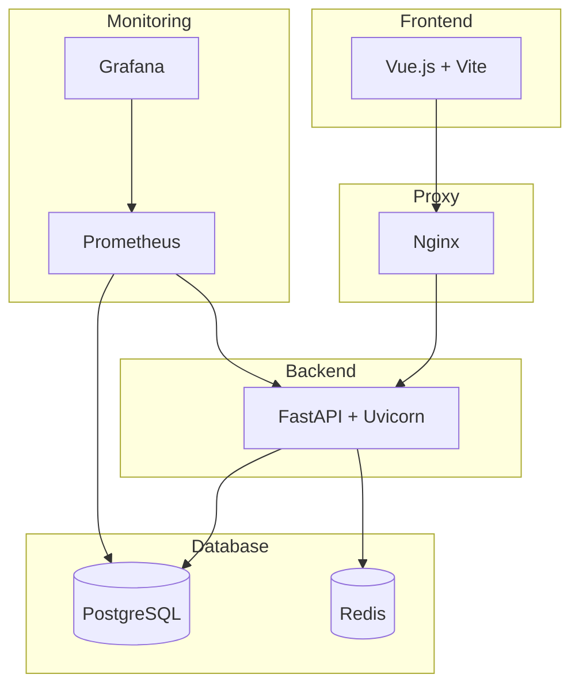

# 🐳 Guía Completa de Docker - VersaAI

## 📋 Índice

- [Arquitectura Docker](#arquitectura-docker)
- [Configuración de Desarrollo](#configuración-de-desarrollo)
- [Configuración de Producción](#configuración-de-producción)
- [Comandos Útiles](#comandos-útiles)
- [Troubleshooting](#troubleshooting)
- [Optimización](#optimización)
- [Seguridad](#seguridad)

## 🏗️ Arquitectura Docker

### Servicios del Stack



### Estructura de Archivos Docker

```
versaai/
├── docker-compose.yml          # Desarrollo
├── docker-compose.prod.yml     # Producción
├── .env.example               # Variables de entorno
├── frontend/
│   └── Dockerfile            # Imagen del frontend
├── backend/
│   ├── Dockerfile           # Imagen del backend
│   ├── docker-compose.yml   # Solo backend + DB
│   └── nginx.conf          # Configuración Nginx
└── Makefile                # Comandos automatizados
```

## 🔧 Configuración de Desarrollo

### docker-compose.yml

El archivo principal para desarrollo incluye:

- **Hot-reload** para frontend y backend
- **Volúmenes** para desarrollo en tiempo real
- **Variables de entorno** para desarrollo
- **Puertos expuestos** para acceso directo

### Servicios de Desarrollo

| Servicio | Puerto | Descripción | Volúmenes |
|----------|--------|-------------|----------|
| frontend | 5173 | Vue.js dev server | `./frontend:/app` |
| backend | 8000 | FastAPI con reload | `./backend:/app` |
| db | 5432 | PostgreSQL | `postgres_data:/var/lib/postgresql/data` |
| redis | 6379 | Redis cache | `redis_data:/data` |

### Comandos de Desarrollo

```bash
# Inicio rápido
make full-dev

# Equivalente manual
docker-compose up -d --build

# Ver logs en tiempo real
make full-logs

# Detener servicios
make full-stop

# Reiniciar servicios
make full-restart
```

## 🚀 Configuración de Producción

### docker-compose.prod.yml

Optimizado para producción con:

- **Builds multi-stage** para imágenes ligeras
- **Nginx** como reverse proxy
- **Health checks** automáticos
- **Resource limits** definidos
- **Restart policies** configuradas
- **Monitoreo** con Prometheus y Grafana

### Servicios de Producción

| Servicio | Puerto | Descripción | Recursos |
|----------|--------|-------------|----------|
| frontend | - | Vue.js build estático | 256MB RAM |
| backend | - | FastAPI optimizado | 512MB RAM |
| nginx | 80/443 | Reverse proxy + SSL | 128MB RAM |
| db | - | PostgreSQL persistente | 1GB RAM |
| redis | - | Redis persistente | 256MB RAM |
| prometheus | 9090 | Métricas | 256MB RAM |
| grafana | 3001 | Dashboards | 256MB RAM |

### Comandos de Producción

```bash
# Deploy completo
make prod-deploy

# Build imágenes de producción
make docker-build-prod

# Inicio manual
docker-compose -f docker-compose.prod.yml up -d --build

# Logs de producción
make prod-logs

# Detener producción
make prod-stop
```

## 🛠️ Comandos Útiles

### Gestión de Contenedores

```bash
# Estado de servicios
make status
docker-compose ps

# Logs específicos
docker-compose logs -f backend
docker-compose logs -f frontend
docker-compose logs -f db

# Ejecutar comandos en contenedores
docker-compose exec backend bash
docker-compose exec frontend sh
docker-compose exec db psql -U versaai_user -d versaai
```

### Gestión de Datos

```bash
# Backup de base de datos
make backup
docker-compose exec db pg_dump -U versaai_user versaai > backup.sql

# Restaurar base de datos
docker-compose exec -T db psql -U versaai_user versaai < backup.sql

# Limpiar volúmenes
docker-compose down -v
docker volume prune
```

### Gestión de Imágenes

```bash
# Build específico
docker-compose build backend
docker-compose build frontend

# Limpiar imágenes
docker image prune -a
docker system prune -a

# Ver uso de espacio
docker system df
```

## 🔍 Troubleshooting

### Problemas Comunes

#### 1. Puerto ya en uso

```bash
# Windows
netstat -ano | findstr :8000
taskkill /PID <PID> /F

# Linux/Mac
lsof -ti:8000 | xargs kill -9

# Docker
docker-compose down
make clean
```

#### 2. Problemas de permisos

```bash
# Linux: Agregar usuario a grupo docker
sudo usermod -aG docker $USER
newgrp docker

# Verificar permisos
docker run hello-world
```

#### 3. Base de datos no conecta

```bash
# Verificar estado
docker-compose ps
docker-compose logs db

# Resetear completamente
docker-compose down -v
docker volume rm versaai_postgres_data
make full-dev
```

#### 4. Frontend no carga

```bash
# Verificar logs
docker-compose logs frontend

# Verificar dependencias
docker-compose exec frontend npm list

# Reinstalar dependencias
docker-compose exec frontend npm install
```

#### 5. Backend no responde

```bash
# Verificar logs
docker-compose logs backend

# Verificar health check
curl http://localhost:8000/api/health

# Reiniciar servicio
docker-compose restart backend
```

### Debugging Avanzado

```bash
# Entrar a contenedor para debugging
docker-compose exec backend bash

# Ver variables de entorno
docker-compose exec backend env

# Verificar conectividad entre servicios
docker-compose exec backend ping db
docker-compose exec backend ping redis

# Monitorear recursos
docker stats
```

## ⚡ Optimización

### Desarrollo

```bash
# Usar caché de Docker
export DOCKER_BUILDKIT=1
export COMPOSE_DOCKER_CLI_BUILD=1

# Build paralelo
docker-compose build --parallel

# Usar .dockerignore
echo "node_modules\n.git\n*.log" > .dockerignore
```

### Producción

```bash
# Multi-stage builds
# Ver Dockerfile para ejemplos

# Optimizar imágenes
docker image ls --format "table {{.Repository}}\t{{.Tag}}\t{{.Size}}"

# Usar Alpine Linux
# FROM node:18-alpine
# FROM python:3.11-alpine
```

### Monitoreo de Performance

```bash
# Métricas de contenedores
docker stats --format "table {{.Container}}\t{{.CPUPerc}}\t{{.MemUsage}}"

# Logs de performance
docker-compose logs --tail=100 backend | grep "INFO"

# Health checks
curl http://localhost:8000/api/health
curl http://localhost:5173
```

## 🔒 Seguridad

### Variables de Entorno

```bash
# NUNCA commitear archivos .env
echo ".env" >> .gitignore

# Usar secrets en producción
docker secret create db_password password.txt
```

### Configuración Segura

```yaml
# docker-compose.prod.yml
services:
  backend:
    user: "1000:1000"  # Usuario no-root
    read_only: true     # Sistema de archivos de solo lectura
    cap_drop:
      - ALL             # Eliminar todas las capabilities
    security_opt:
      - no-new-privileges:true
```

### Actualizaciones

```bash
# Actualizar imágenes base
docker-compose pull
docker-compose up -d --build

# Escanear vulnerabilidades
docker scan versaai_backend:latest
docker scan versaai_frontend:latest
```

## 📊 Monitoreo

### Prometheus Metrics

Acceso: http://localhost:9090

```promql
# CPU usage
rate(container_cpu_usage_seconds_total[5m])

# Memory usage
container_memory_usage_bytes

# HTTP requests
http_requests_total
```

### Grafana Dashboards

Acceso: http://localhost:3001
- Usuario: admin
- Contraseña: admin

**Dashboards incluidos:**
- Docker Container Metrics
- FastAPI Application Metrics
- PostgreSQL Database Metrics
- Nginx Proxy Metrics

### Health Checks

```bash
# Verificar todos los servicios
make health

# Health check manual
curl http://localhost:8000/api/health
curl http://localhost:5173

# Estado de Docker
docker-compose ps
docker system df
```

## 🚀 Deploy en Producción

### Checklist Pre-Deploy

- [ ] Variables de entorno configuradas
- [ ] Certificados SSL configurados
- [ ] Backup de base de datos realizado
- [ ] Tests pasando
- [ ] Imágenes construidas y testeadas
- [ ] Monitoreo configurado

### Proceso de Deploy

```bash
# 1. Preparar entorno
cp .env.example .env.prod
# Editar .env.prod con configuración de producción

# 2. Build y test
make docker-build-prod
make test

# 3. Deploy
make prod-deploy

# 4. Verificar
make prod-logs
make health
```

### Rollback

```bash
# Rollback rápido
docker-compose -f docker-compose.prod.yml down
docker-compose -f docker-compose.prod.yml up -d --build

# Restaurar backup de DB
docker-compose exec -T db psql -U versaai_user versaai < backup_previous.sql
```

---

## 📚 Referencias

- [Docker Compose Documentation](https://docs.docker.com/compose/)
- [FastAPI Docker Guide](https://fastapi.tiangolo.com/deployment/docker/)
- [Vue.js Docker Guide](https://vuejs.org/guide/best-practices/production-deployment.html)
- [PostgreSQL Docker Hub](https://hub.docker.com/_/postgres)
- [Redis Docker Hub](https://hub.docker.com/_/redis)
- [Nginx Docker Hub](https://hub.docker.com/_/nginx)

---

**Última actualización:** $(date)
**Versión:** 1.0
**Mantenido por:** Equipo VersaAI